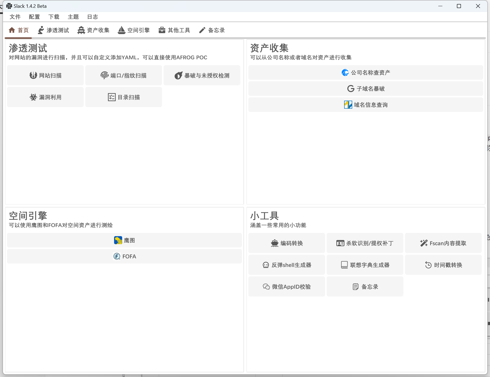

# 使用说明

## 首页

所见即所得，点击对应的按钮会跳转到相应的模块



## 渗透测试

### 网站扫描

网站扫描功能缝了`afrog`[项目地址](https://github.com/zan8in/afrog)，基本就是差不多把该扫描器的功能`UI`化，且内置反连无需再配置`ceye`或`jndi(已将jndi有关poc全部替换成反连)`地址，主动探测的漏洞或者指纹会写入到`report`目录下的`html`文件中，并没有将`afrog`命令的输出进行删除（所以你在`go run main.go`运行工具时，依然能看到命令行存在`afrog`的输出内容）

**目标格式支持 `URL` 或者 `IP:PORT`**

#### 仅指纹扫描/指纹`POC`扫描/主动指纹探测

- 仅指纹扫描：只对当前网页发送两个数据包进行探测指纹
- 主动指纹探测： 需要配合仅指纹扫描一起使用，在指纹扫描的基础上，增加主动指纹探测（可能会导致`IP`封禁）
- 指纹`POC`扫描： 根据网页指纹进行`POC`扫描，此过程种会进行主动目录探测例如`Nacos|XXL-JOB`等并会将其当作指纹`，避免发送无用数据包，导致扫的很慢


运行优先级，如果你勾选了仅指纹扫描 > 指纹`POC`扫描

#### 自定义`POC`扫描

- 关键字（搜关键字）：

根据`yaml poc`的`id`值进行检测关键字

- 风险等级：

根据`yaml poc`的`severity`值进行检测风险等级


#### 联动`FOFA`、鹰图

导入模式都与你正常网页搜索一样，不包含去重、排除等，`FOFA`最多导入1000条资产，鹰图最多导入500(考虑到正常账号也就500免费积分)


#### 任务下发

执行流程 【】表示获得的内容 []表示待执行的内容

```
1、传入公司名称 -> 天眼查、备案查【根域名组】 -> fofa【IP|URL|子域名】 -> [IP] -> 端口扫描【协议://IP:端口，会将IP对应的域名都替换一遍】 -> HTTP 等待和URL一起进入网站扫描，其他可暴破服务进入端口暴破
```

### 端口/指纹扫描

勾选`ICMP`会先进行主机探活，端口指纹协议调用的`lcvvvv`大佬的`gonmap`库并添加了`JDWP`指纹识别，右键结果框可以看到

- 发送HTTP目标

将`HTTP || HTTPS`服务发送到网站扫描模块目标中，需要点击扫描

- 发送可暴破目标

将`ftp、ssh、telnet、smb、oracle、mssql、mysql、rdp、postgresql、vnc、redis、memcached、mongodb`几类服务发送到端口暴破模块目标中，需要点击开始、

- 目标支持换行分割,IP支持如下格式:

```
192.168.1.1
192.168.1.1/8
192.168.1.1/16
192.168.1.1/24
192.168.1.1,192.168.1.2
192.168.1.1-192.168.255.255
192.168.1.1-255

排除IP可以在可支持输入的IP格式前加!:
!192.168.1.6/28
...

如果端口遗漏多请在配置中调高端口超时时间,默认10s
```


### 端口暴破

目标请输入成如下格式

```
protocol://ip:port，例如:

redis://10.0.0.1:6379
mysql://10.0.0.1:3306
```

账号密码框处支持，直接将txt文件拖入作为字典，或者单账号名输入，要使用自己的字典请**取消勾选使用内置字典**

**联想模式** 顾名思义就是给出一定的条件，生成的特定字典，会联动其他工具处进行使用


### 目录扫描


### 漏洞利用

目前支持验证漏洞，暂时没做别的

```
Apache Hadoop Yarn RPC RCE
```

对于一些无回显的`POC`会提示执行反弹`shell`命令


## 资产收集模块

### 公司名称查资产

查看控股企业获得1级全资子公司的域名或者股权等信息，勾选查询`HUNTER`资产数量会查询资产数量，运行完毕后运行左上角日志处会出现提示


### 子域名暴破

此模块在v1.4已更新，使用了IP纯真库以及CName关键字匹配进行CDN校验，注意如果网络环境差会导致暴破的很慢，这个自行考究


### 域名信息收集


## 空间引擎

### 鹰图

整体风格和功能都跟`fofaview`类似，注意勾选上数据去重后需要消耗权益积分，没有权益积分的话别勾选，v1.4新增批量查询功能。

`HUNTER`模块标签右键功能与`Web`扫描一致，查询框右键可以查看历史查询记录


导出方式分为

- 全部导出，需要消耗积分，导出最大数量，以当前可用积分为准
- 导出当前数据，不消耗积分，仅保存当前查询结果


### `FOFA`

`FOFA`功能和鹰图几乎一致，不多做介绍，排除干扰，以及证书校验功能需要专业版及以上可用


## 小工具

### 编码转换

从上到下进行模式加解密（比如我先添加了`Base64`，再添加`Urlencode`那程序会按添加顺序进行操作）。

点击添加模式添加内容，右键已添加的列表进行删除


### 杀软识别&补丁检测

杀软库可以通过修改`./config/antivirues.yaml`文件增加杀软指纹。


### `Fscan`内容提取

除了常见的一些结果，另外添加了vcenter和海康摄像头的识别


### 反弹`shell`生成器


### 联想字典生成器


### 备忘录


# 运行

由于该程序的`UI`库采用的`fyne`底层基于`C++`如果直接运行`main.go`文件则所以需要环境中先配置好`GCC`的环境才可以正常使用，还需要存在`go`环境

# 中文显示问题&内存问题

由于`Fyne`原生不支持中文字体的原因，所以需要引入外部字体文件解决中文乱码问题，但是`Windows`的字体文件要么过大（会导致引入中文字体后程序运行内存占用增加的问题）要么就是显示不清晰的问题，所以需要压缩`TTF(暂不支持TTC)`字体文件来到达减小程序内存占用的问题，经过测试加载中文字体内存占用增加`50MB`。

1、使用`python3 pip` 安装`fonttools`工具` pip install fonttools`or`python3 -m pip install fonttools`检查是否安装成功。


2、选择ttf字体文件对其进行压缩（即只保留txt中的字符文件）`fonttools subset ".\Dengb.ttf" --text-file=".\汉语字典.txt" --output-file="ysfonts.ttf"`，前往`gui\mytheme\fonts`目录下将`ysfonts.tff`字体替换即可。


# 打包

使用`fyne`自带的打包模块，体积更小还能打包`logo`（`ico、png、jpg`都支持），打包完差不多`120MB`，后续可以用`upx`进行压缩体积

```
[go>=1.16]
go install fyne.io/fyne/v2/cmd/fyne@latest 
[go<1.16]
go get fyne.io/fyne/v2/cmd/fyne@latest    
```

- `windows`

  `fyne package -os windows -icon .\gui\mytheme\static\logo.ico .\main.go`

- 其他平台

  也可以使用`fyne package`或者`go build main.go`
  

# 一些模块的拓展规则

## 指纹拓展

从`slack v1.1`开始舍弃了`iconmd5`指纹，规则如下所示，第一行为指纹名称，后续可以有3个键值对，分别为`title`匹配网页标题名，`iconhash`是`favicon`的`Mmh3Hash32`值可以通过`example/iconhash/main.go`文件进行计算，`header`匹配响应头中的内容，`yaml`规则尽量最外层是''即可不用转译双引号以及冒号等符号干扰（所有文本仅先按照 || 条件进行的分割），不懂再问我

```yaml
腾达路由器:
  title: '(Tenda && LOGIN) || (Tenda && Router) || (Tenda && Login) || (Tenda && Wi-Fi)  || (Tenda && 登录) || (Tenda && Web Master)) || 腾达无线路由器'
  iconhash: '-2145085239'
Nexus Repository Manager: 
  title: 'Nexus Repository Manager'
  iconhash: '1323738809 || -1546574541'
  header: 'NX-ANTI-CSRF-TOKEN'
Nginx:
  title: "Welcome to nginx!"
  header: 'Server:nginx'
```

## `POC`编写

`config\afrog-pocs\README.md`文件下有详细的规则

由于指纹`POC`根据`config/workflow.yaml`中的定义的指纹名称以及`POC`数组的值对进行攻击，**且因为存在`afrog`的更新模块，他的`poc`有更新的时候会自动下载的用户根目录下，请自行查看更新以及添加**，后续需要拓展指纹要攻击的`POC`可以自行添加`workflow.yaml`文件中，如果是新增指纹同时加指纹`POC`，请保持指纹名称一致，但不区分大小写


## 杀软库拓展

匹配运行的进程名`finger/antivirues.yaml`

## 验证指纹是否可用

`example`目录下存放着一些测试文件，可以运行监测，特别是如果识别不到指纹，一定要检查`YAML`文件格式是否编写错误

# FAQ

- 为什么不做`SYN`扫描（暂时没做）

# 更新日志

`2023年9月25日 v1.4.1`

```
新增:
1、目录扫描功能、时间戳转换小工具
2、新增首页导航栏，可以快速定位需要使用的模块

优化:
1、修复子域名暴破缓慢以及日志刷新过于频繁导致的程序退出
2、修复域名备案&whois查询时因为查询不到结果导致的下标越界
3、优化了表格控件目前支持左右拉动
4、优化了POC更新、IP纯真库下载以及日志功能，目前均处于菜单栏处
5、优化了任务下发时的工作逻辑，减少工作量
```

`2023年9月20日 v1.4`

```
新增:
1、新增控制台(右下角)，在大部分运行进度等日志会在控制台输出
2、鹰图模块增加批量查询功能
3、其他工具模块增加 
	(1) systeminfo提权补丁查询
	(2) 反弹shell生成器
	(3) 联想字典生成器
4、资产收集模块增加
	(1) 端口暴破("ftp", "ssh", "telnet", "smb", "mssql", "oracle", "mysql", "postgresql", "vnc", "redis", "mongodb")、支持联想模式 
	(2) 域名备案&whois查询
5、网站扫描功能，新增任务下发按键 beta版(仅需要输入公司名称即可完全全量信息收集以及漏洞扫描、端口暴破)

优化:
1、其他工具->IP&CDN模块、域名CDN识别规则重写(目前根据CNAME)中出现的关键字判断
2、子域名暴破去除了HTTP请求，规则库改为使用IP纯真库以及CNAME关键字判断
3、增加部分poc
```

`v1.3`

```
1、网站扫描功能增加搜索引擎联动，目前支持鹰图和FOFA

2、网站扫描功能支持指定文件夹POC进行扫描

3、取消反连配置，改为内置CEYE，JNDI相关POC也都已经更改为反连探测

4、增加单独检测FastJson漏洞功能
```

`v1.2`

```
1、完善了FOFA查询功能，目前可以跟鹰图一样使用

2、网站扫描：
	(1)优化了界面布局
	(2)增加停止扫描功能
	(3)目标支持x.x.x.x:80形式
	(4)指纹匹配规则进行了优化，之前会出现指纹匹配不上的问题
	(5)仅指纹扫描功能取消敏感目录探测(帆神说被封了要赔他IP)
	
3、优化了备忘录界面布局

4、UI库全新升级界面更美观，控件做了圆角、以及阴影处理，新版本中表格控件目前存在bug，所以目前使用的仍然是老版本的代码

5、带有文件logo的文本框，可以将txt文件移入读取路径
```

`v1.1`

```
1、在菜单栏中新增了主题配置的功能，可以调节字体大小以及主题颜色，为了防止黑色主题下图标不清晰情况，并已更改原先的图标(图标路径在gui\mytheme\static\下，未编译情况下可以替换文件自行更改)，切换主题会导致程序运行内存增加，重新启动即可

2、WEB扫描模块优化了代理检测，开始扫描时会优先检测代理连通性，再决定能否开始扫描

3、增加了漏洞验证模块，目前支持Redis未授权、Hadoop未授权RCE漏洞

4、优化了指纹拓展性，已将内置指纹更改为外部存放, 并重新进行整理(后续指纹等配置文件全部存储在config目录下，程序不便移动，需要放在对应目录下执行)

5、WEB扫描模块增加从指纹自动识别POC进行攻击

6、优化了一下&输出被转译等其他Bug
```

# 联系方式

如果有问题可以加我联系方式进工具交流群


